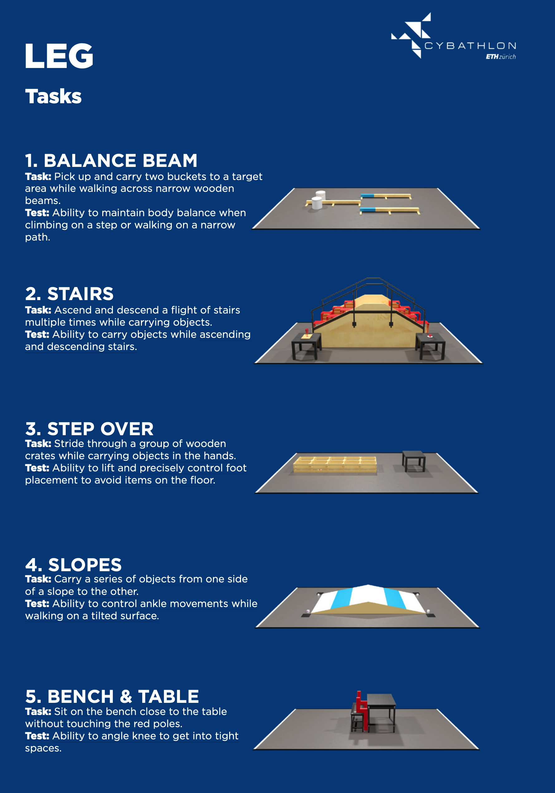
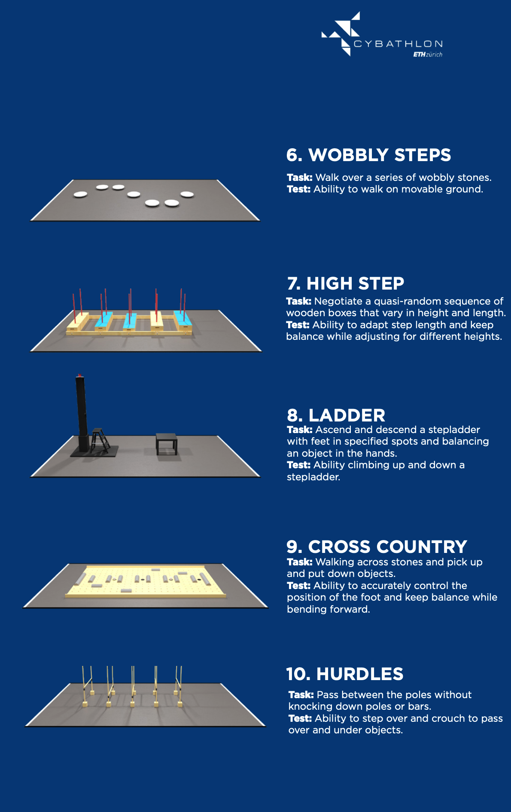

# Ciervo
El codigo busca crear un paquete llamado `ciervo` que contiene los modulos necesarios para el procesamiento de las señales EMG, clasificación y simulación. Este paquete es publicado en el repositorio de PyPi para su uso luego de cada merge. 


# Como contribuir
Para contribuir al proyecto, se debe seguir los siguientes pasos:
1. Clona el repositorio
2. Crea una rama con el nombre de la tarea que vas a realizar
3. Realiza los cambios necesarios
4. Realiza un pull request a la rama `main`

# Como instalar
Para instalar el paquete se debe ejecutar el siguiente comando:
```bash
pip install ciervo --upgrade
```

Los requerimientos necesarios para la instalación del paquete se encuentran en el archivo `requirements.txt`. Porfavor, solo utilizar Pytorch > 2.0.0. para deep learning. 

# Como usar
Dirigite a la [Wiki](https://github.com/Proyecto-ing-biomed-UC/Ciervo/wiki) del proyecto para ver como usar el paquete. 


# Literatura
Literatura relevante para el desarrollo del proyecto.

### EMG
* [The ABC of EMG](https://www.noraxon.com/wp-content/uploads/2014/12/ABC-EMG-ISBN.pdf)


### Procesamiento de señales
* [La transformada de Fourier](https://youtu.be/spUNpyF58BY?si=TnrIeHloi3mkD0Rk)
* [Filtrado](https://medium.com/analytics-vidhya/how-to-filter-noise-with-a-low-pass-filter-python-885223e5e9b7)


# Races [link](https://cybathlon.ethz.ch/documents/downloads/CYBATHLON%202024/2400318_LEG_EN.pdf)
<details>
<summary> details </summary>






</details>


